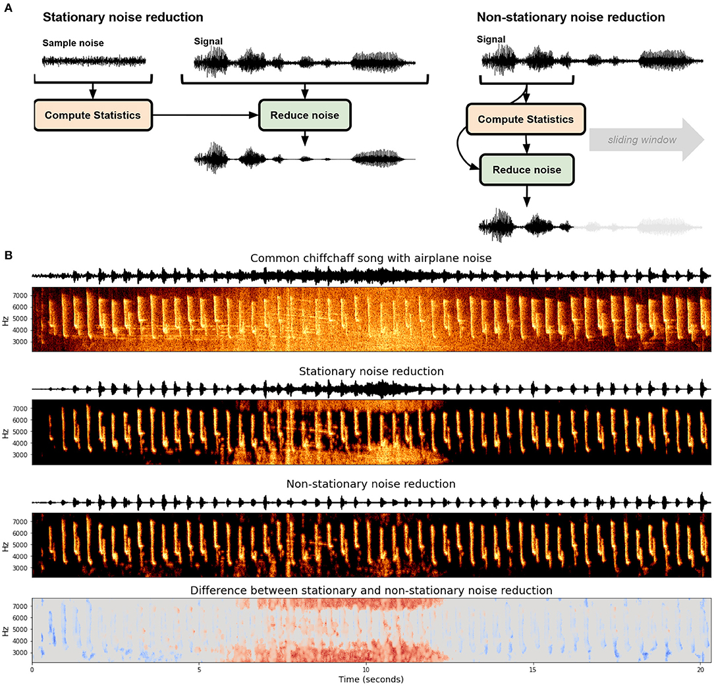

[](https://travis-ci.com/timsainb/noisereduce)
[](https://coveralls.io/github/timsainb/noisereduce?branch=master)
[](https://mybinder.org/v2/gh/timsainb/noisereduce/master?filepath=notebooks%2F1.0-test-noise-reduction.ipynb)
[](https://colab.research.google.com/github/timsainb/noisereduce/blob/master/notebooks/1.0-test-noise-reduction.ipynb)
[](https://badge.fury.io/py/noisereduce)

<div style="text-align:center">
<p align="center">
  
</p>
</div>

# Noise reduction in python using spectral gating
Noisereduce is a noise reduction algorithm in python that reduces noise in time-domain signals like speech, bioacoustics, and physiological signals. It relies on a method called "spectral gating" which is a form of [Noise Gate](https://en.wikipedia.org/wiki/Noise_gate). It works by computing a spectrogram of a signal (and optionally a noise signal) and estimating a noise threshold (or gate) for each frequency band of that signal/noise. That threshold is used to compute a mask, which gates noise below the frequency-varying threshold. 

The most recent version of noisereduce comprises two algorithms:
1. **Stationary Noise Reduction**: Keeps the estimated noise threshold at the same level across the whole signal
2. **Non-stationary Noise Reduction**: Continuously updates the estimated noise threshold over time

### Version 3 Updates:
- Includes a PyTorch-based implementation of Spectral Gating, an algorithm for denoising audio signals. 
- You can now create a noisereduce nn.Module object which allows it to be used either as a standalone module or as part of a larger neural network architecture.
- The run time of the algorithm decreases substantially.

### Version 2 Updates:
- Added two forms of spectral gating noise reduction: stationary noise reduction, and non-stationary noise reduction. 
- Added multiprocessing so you can perform noise reduction on bigger data.
- The new version breaks the API of the old version. 
- The previous version is still available at `from noisereduce.noisereducev1 import reduce_noise`
- You can now create a noisereduce object which allows you to reduce noise on subsets of longer recordings

# Stationary Noise Reduction
- The basic intuition is that statistics are calculated on  each frequency channel to determine a noise gate. Then the gate is applied to the signal.
- This algorithm is based (but not completely reproducing) on the one [outlined by Audacity](https://wiki.audacityteam.org/wiki/How_Audacity_Noise_Reduction_Works) for the **noise reduction effect** ([Link to C++ code](https://github.com/audacity/audacity/blob/master/src/effects/NoiseReduction.cpp))
- The algorithm takes two inputs: 
    1. A *noise* clip containing prototypical noise of clip (optional)
    2. A *signal* clip containing the signal and the noise intended to be removed

### Steps of the Stationary Noise Reduction algorithm
1. A spectrogram is calculated over the noise audio clip
2. Statistics are calculated over spectrogram of the the noise (in frequency)
3. A threshold is calculated based upon the statistics of the noise (and the desired sensitivity of the algorithm) 
4. A spectrogram is calculated over the signal
5. A mask is determined by comparing the signal spectrogram to the threshold
6. The mask is smoothed with a filter over frequency and time
7. The mask is appled to the spectrogram of the signal, and is inverted
*If the noise signal is not provided, the algorithm will treat the signal as the noise clip, which tends to work pretty well*

# Non-stationary Noise Reduction
- The non-stationary noise reduction algorithm is an extension of the stationary noise reduction algorithm, but allowing the noise gate to change over time. 
- When you know the timescale that your signal occurs on (e.g. a bird call can be a few hundred milliseconds), you can set your noise threshold based on the assumption that events occuring on longer timescales are noise. 
- This algorithm was motivated by a recent method in bioacoustics called Per-Channel Energy Normalization. 

### Steps of the Non-stationary Noise Reduction algorithm
1. A spectrogram is calculated over the signal
2. A time-smoothed version of the spectrogram is computed using an IIR filter aplied forward and backward on each frequency channel.
3. A mask is computed based on that time-smoothed spectrogram
4. The mask is smoothed with a filter over frequency and time
5. The mask is appled to the spectrogram of the signal, and is inverted

# Installation
`pip install noisereduce`

# Usage
See example notebook: [](https://colab.research.google.com/github/timsainb/noisereduce/blob/master/notebooks/1.0-test-noise-reduction.ipynb)
Parallel computing example: [](https://colab.research.google.com/github/timsainb/noisereduce/blob/master/notebooks/2.0-test-noisereduce-pytorch.ipynb)

## reduce_noise

### Simplest usage
```
from scipy.io import wavfile
import noisereduce as nr
# load data
rate, data = wavfile.read("mywav.wav")
# perform noise reduction
reduced_noise = nr.reduce_noise(y=data, sr=rate)
wavfile.write("mywav_reduced_noise.wav", rate, reduced_noise)
```

### Arguments to `reduce_noise`
```
y : np.ndarray [shape=(# frames,) or (# channels, # frames)], real-valued
      input signal
  sr : int
      sample rate of input signal / noise signal
  y_noise : np.ndarray [shape=(# frames,) or (# channels, # frames)], real-valued
      noise signal to compute statistics over (only for non-stationary noise reduction).
  stationary : bool, optional
      Whether to perform stationary, or non-stationary noise reduction, by default False
  prop_decrease : float, optional
      The proportion to reduce the noise by (1.0 = 100%), by default 1.0
  time_constant_s : float, optional
      The time constant, in seconds, to compute the noise floor in the non-stationary
      algorithm, by default 2.0
  freq_mask_smooth_hz : int, optional
      The frequency range to smooth the mask over in Hz, by default 500
  time_mask_smooth_ms : int, optional
      The time range to smooth the mask over in milliseconds, by default 50
  thresh_n_mult_nonstationary : int, optional
      Only used in nonstationary noise reduction., by default 1
  sigmoid_slope_nonstationary : int, optional
      Only used in nonstationary noise reduction., by default 10
  n_std_thresh_stationary : int, optional
      Number of standard deviations above mean to place the threshold between
      signal and noise., by default 1.5
  tmp_folder : [type], optional
      Temp folder to write waveform to during parallel processing. Defaults to 
      default temp folder for python., by default None
  chunk_size : int, optional
      Size of signal chunks to reduce noise over. Larger sizes
      will take more space in memory, smaller sizes can take longer to compute.
      , by default 60000
      padding : int, optional
      How much to pad each chunk of signal by. Larger pads are
      needed for larger time constants., by default 30000
  n_fft : int, optional
      length of the windowed signal after padding with zeros.
      The number of rows in the STFT matrix ``D`` is ``(1 + n_fft/2)``.
      The default value, ``n_fft=2048`` samples, corresponds to a physical
      duration of 93 milliseconds at a sample rate of 22050 Hz, i.e. the
      default sample rate in librosa. This value is well adapted for music
      signals. However, in speech processing, the recommended value is 512,
      corresponding to 23 milliseconds at a sample rate of 22050 Hz.
      In any case, we recommend setting ``n_fft`` to a power of two for
      optimizing the speed of the fast Fourier transform (FFT) algorithm., by default 1024
  win_length : [type], optional
      Each frame of audio is windowed by ``window`` of length ``win_length``
      and then padded with zeros to match ``n_fft``.
      Smaller values improve the temporal resolution of the STFT (i.e. the
      ability to discriminate impulses that are closely spaced in time)
      at the expense of frequency resolution (i.e. the ability to discriminate
      pure tones that are closely spaced in frequency). This effect is known
      as the time-frequency localization trade-off and needs to be adjusted
      according to the properties of the input signal ``y``.
      If unspecified, defaults to ``win_length = n_fft``., by default None
  hop_length : [type], optional
      number of audio samples between adjacent STFT columns.
      Smaller values increase the number of columns in ``D`` without
      affecting the frequency resolution of the STFT.
      If unspecified, defaults to ``win_length // 4`` (see below)., by default None
  n_jobs : int, optional
      Number of parallel jobs to run. Set at -1 to use all CPU cores, by default 1
  torch_flag: bool, optional
      Whether to use the torch version of spectral gating, by default False
  device: str, optional
      A device to run the torch spectral gating on, by default "cuda"
```

## Torch
See example notebook: [](https://colab.research.google.com/github/timsainb/noisereduce/blob/master/notebooks/3.0-torchgate-as-nn-module.ipynb)
### Simplest usage
```
import torch
from noisereduce.torchgate import TorchGate as TG
device = torch.device("cuda") if torch.cuda.is_available() else torch.device("cpu")

# Create TorchGating instance
tg = TG(sr=8000, nonstationary=True).to(device)

# Apply Spectral Gate to noisy speech signal
noisy_speech = torch.randn(3, 32000, device=device)
enhanced_speech = tg(noisy_speech)
```
### Arguments
| Parameter                | Description                                                                                           |
|--------------------------|-------------------------------------------------------------------------------------------------------|
| sr                       | Sample rate of the input signal.                                                                      |
| n_fft                    | The size of the FFT.                                                                                  |
| hop_length               | The number of samples between adjacent STFT columns.                                                  |
| win_length               | The window size for the STFT. If None, defaults to n_fft.                                             |
| freq_mask_smooth_hz      | The frequency smoothing width in Hz for the masking filter. If None, no frequency masking is applied. |
| time_mask_smooth_ms      | The time smoothing width in milliseconds for the masking filter. If None, no time masking is applied. |
| n_std_thresh_stationary  | The number of standard deviations above the noise mean to consider as signal for stationary noise.    |
| nonstationary            | Whether to use non-stationary noise masking.                                                          |
| n_movemean_nonstationary | The number of frames to use for the moving average in the non-stationary noise mask.                  |
| n_thresh_nonstationary   | The multiplier to apply to the sigmoid function in the non-stationary noise mask.                     |
| temp_coeff_nonstationary | The temperature coefficient to apply to the sigmoid function in the non-stationary noise mask.        |
| prop_decrease            | The proportion of decrease to apply to the mask.                                                      |

## Choosing between Stationary and non-stantionary noise reduction 

I discuss stationary and non-stationary noise reduction in [this paper](https://www.frontiersin.org/articles/10.3389/fnbeh.2021.811737/full). 

<div style="text-align:center">
<p align="center">
  
</p>
</div>

*Figure caption: Stationary and non-stationary spectral gating noise reduction. (A) An overview of each algorithm. Stationary noise reduction typically takes in an explicit noise signal to calculate statistics and performs noise reduction over the entire signal uniformly. Non-stationary noise reduction dynamically estimates and reduces noise concurrently. (B) Stationary and non-stationary spectral gating noise reduction using the noisereduce Python package (Sainburg, 2019) applied to a Common chiffchaff (Phylloscopus collybita) song (Stowell et al., 2019) with an airplane noise in the background. The bottom frame depicts the difference between the two algorithms.*

## Citation
If you use this code in your research, please cite it:
```

@article{sainburg2020finding,
  title={Finding, visualizing, and quantifying latent structure across diverse animal vocal repertoires},
  author={Sainburg, Tim and Thielk, Marvin and Gentner, Timothy Q},
  journal={PLoS computational biology},
  volume={16},
  number={10},
  pages={e1008228},
  year={2020},
  publisher={Public Library of Science}
}

@software{tim_sainburg_2019_3243139,
  author       = {Tim Sainburg},
  title        = {timsainb/noisereduce: v1.0},
  month        = jun,
  year         = 2019,
  publisher    = {Zenodo},
  version      = {db94fe2},
  doi          = {10.5281/zenodo.3243139},
  url          = {https://doi.org/10.5281/zenodo.3243139}
}


```
--------

<p><small>Project based on the <a target="_blank" href="https://drivendata.github.io/cookiecutter-data-science/">cookiecutter data science project template</a>. #cookiecutterdatascience</small></p>


